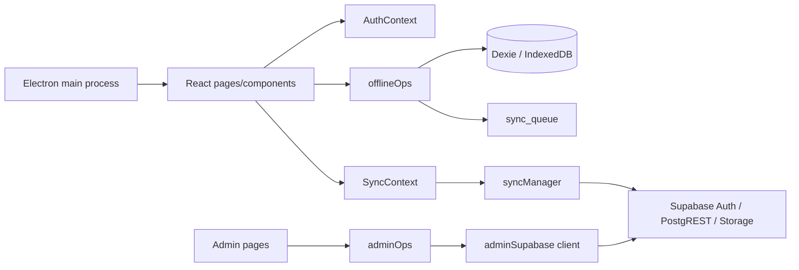

# Architecture

## Runtime shape

The client has no traditional backend layers. `src/lib/offlineOps.js` is the closest equivalent to a data service/repository; `src/lib/syncManager.js` is the application synchronization coordinator. Supabase supplies authentication, database REST endpoints, and object storage directly to the renderer.

### Later schema evidence and V2 foundation

This document originally described source-visible V1 behavior only. The subsequently pulled production baseline and `20260913235959_v2_inventory_foundation.sql` establish a separate database-side V2 foundation: append-only inventory movement RPCs, materialized balances, metadata-version/unit triggers, and RLS. Dexie v2, the generic outbox, and V1 UI do not call these objects yet; they become active application architecture only in later V2 substeps.

## Request/data paths

- Normal catalog reads use Dexie only (`getProducts(userId)`, `getCategories(userId)`). `SyncProvider` starts a push-then-pull sync after login and when the browser becomes online.
- Normal catalog writes create/update/delete the local record first and append a `sync_queue` entry. A future successful `fullSync` sends the queued mutation and then pulls remote rows for the current `user_id`.
- Image files are resized to max 400x400 JPEG/base64 before local persistence. Sync uploads pending base64 images to `product-images`, replaces local base64 with the public URL, then writes the product row.
- Admin requests bypass this pattern: pages call `adminOps`, which calls Supabase Auth Admin and table APIs directly. This is security-sensitive; see [06](06-AUTH-AND-PERMISSIONS.md).

## Patterns and omissions

React context is used only for auth and sync metadata; page-local `useState` owns view and form state. There is no global state library, React Query, schema validator, backend validation, error boundary, observability client, realtime subscription, custom event, job, notification, email, or cache layer.

`vite.config.js` configures Workbox precaching and a `NetworkFirst` cache for the hard-coded Supabase project URL. This is PWA caching, not domain-data synchronization. The README's claim of Supabase Realtime is not supported: no `channel`, subscription, or realtime handler exists in current source.
