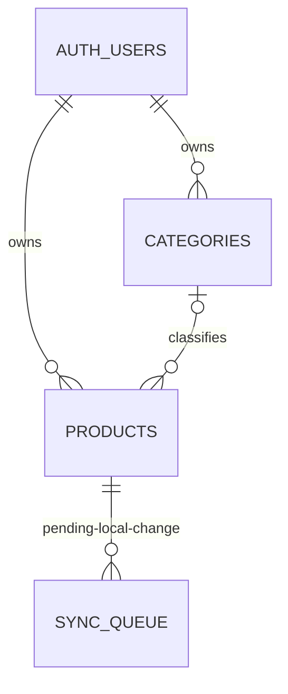

# Domain model

## Active concepts

| Entity | Purpose and lifecycle | Ownership/rules |
|---|---|---|
| Auth user | Supabase Auth identity, created by email/password signup. App metadata may carry `role: superadmin`. | `user.id` scopes catalog data. Signup/login policy is configured remotely and cannot be confirmed here. |
| Category | A named user-owned grouping for products. Created inline in `ProductForm` or managed on `/categories`; rename/delete are local-first. | `id`, `user_id`, `name`, `created_at`. No duplicate-name or non-empty enforcement beyond client trimming. |
| Product | User-owned catalog item with optional category/image and wholesale/selling prices. | Required client fields: name and numeric prices; `category_id` optional. It is hard-deleted locally and remotely after sync. |
| Sync queue | Browser-local outbox for product/category INSERT, UPDATE, DELETE. | Not user-scoped in its Dexie index/schema; processed in insertion order. |
| Admin view | Cross-user operational view, not a separate persisted domain model. | Assumes `app_metadata.role === 'superadmin'`; it can ban/unban auth users. |

## Product lifecycle

`ProductForm` validates nonblank `name` and parseable prices, creates a UUID and timestamps in `offlineOps.addProduct`, persists it in Dexie, and queues an INSERT. Edit updates Dexie and queues an UPDATE. Delete removes it from Dexie immediately and queues DELETE; its storage image is deleted on successful sync. Image replacement records `_old_image_url` in the queue, then sync deletes the old object before the row update. Removing an image invokes `deleteImage` immediately from the form before queuing the row update.

Category deletion does not update local products that reference it. Whether remote referential behavior sets the product category to null is **unable to confirm** because the current schema/migrations are absent.

## Dormant remote ERP schema and V2 foundation

This document's earlier historical-Git conclusion was limited to source evidence. The later pulled remote baseline confirms that `customers`, `suppliers`, invoices/purchases and items, payments, ledger entries, and legacy `stock_movements` exist in the remote schema. The local production-backup audit found zero rows in each of those dormant ERP tables and in legacy `stock_movements`; none is an active V1 application domain.

V2 now adds an **active database foundation**—`inventory_balances` plus V2-typed `stock_movements`—but no V2 UI, Dexie, or sync caller yet. Existing products remain Stock not set because no legacy quantity or movement value is adopted as inventory history.
