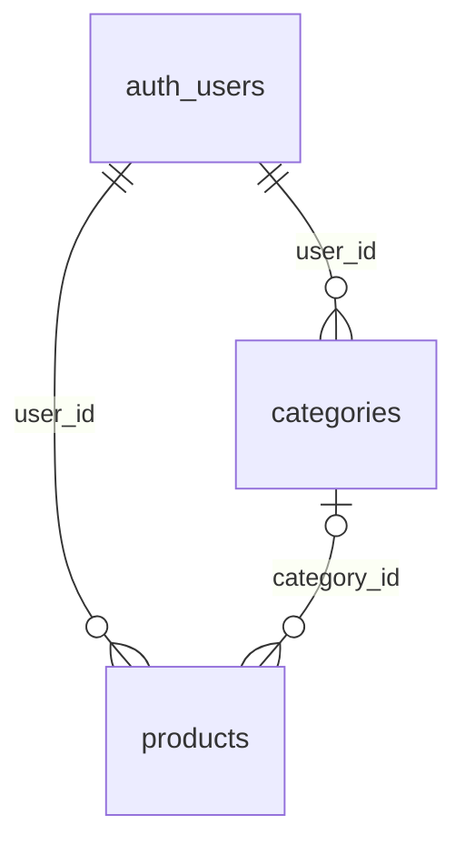

# Database discovery

## Evidence boundary

This section was originally source-code-only. A later pulled production baseline is now versioned as `supabase/migrations/20260913182956_remote_schema.sql`; it confirms tables, constraints, grants, and policies as of that pull. `20260913235959_v2_inventory_foundation.sql` is the additive V2 local-tested foundation. The production-data audit is aggregate-only and establishes that legacy inventory/ERP fields are dormant in its snapshot.

| Remote table | Confirmed columns used | Relationships / notes |
|---|---|---|
| `products` | `id`, `user_id`, `name`, `image_url`, `wholesale_price`, `selling_price`, `category_id`, `created_at`, `updated_at` | `user_id` is queried for ownership; `category_id` is treated as nullable. `id` is client UUID. |
| `categories` | `id`, `user_id`, `name`, `created_at` | Queried by `user_id`; update sends full local record. |
| Supabase Auth users | `id`, `email`, `created_at`, `banned_until`, `app_metadata` | Used by admin APIs; managed by Supabase Auth. |
| Storage bucket `product-images` | object path/public URL | Browser uploads JPEGs and obtains public URLs. |

## Local IndexedDB schema

`src/lib/db.js` declares Dexie database `DokkanexDB`. Version 2 is the active code schema:

| Store | Indexed fields / content |
|---|---|
| `products` | Primary `id`; indexes `name`, `category_id`, `user_id`, timestamps, `image_url`, `image_base64` |
| `categories` | Primary `id`; indexes `name`, `user_id`, `created_at` |
| `sync_queue` | Auto-increment `id`; table, operation, record id, data, timestamp |
| `app_meta` | Key/value metadata, currently `last_sync` |

The pulled baseline confirms `products.category_id -> categories.id ON DELETE SET NULL`, duplicate permissive V1 ownership policies, legacy movement RLS policies without normal browser data grants, and the broad existing `product-images` policy. V2 adds versioning/archive product columns, `inventory_balances`, V2 movement columns, RPCs, and narrow V2 read/RPC access. It deliberately does not clean up legacy product/category policies or Storage in this step.

## Schema consistency observations

- Local products have `image_base64`, a deliberately Dexie-only field stripped before remote writes.
- Category pull calls `db.categories.clear()` for every user sync, while products are merged. In a shared browser profile this can remove other users' cached categories.
- The client supplies `user_id`, IDs, and timestamps. Remote RLS/defaults/constraints must protect those fields; their actual presence is unverified.
