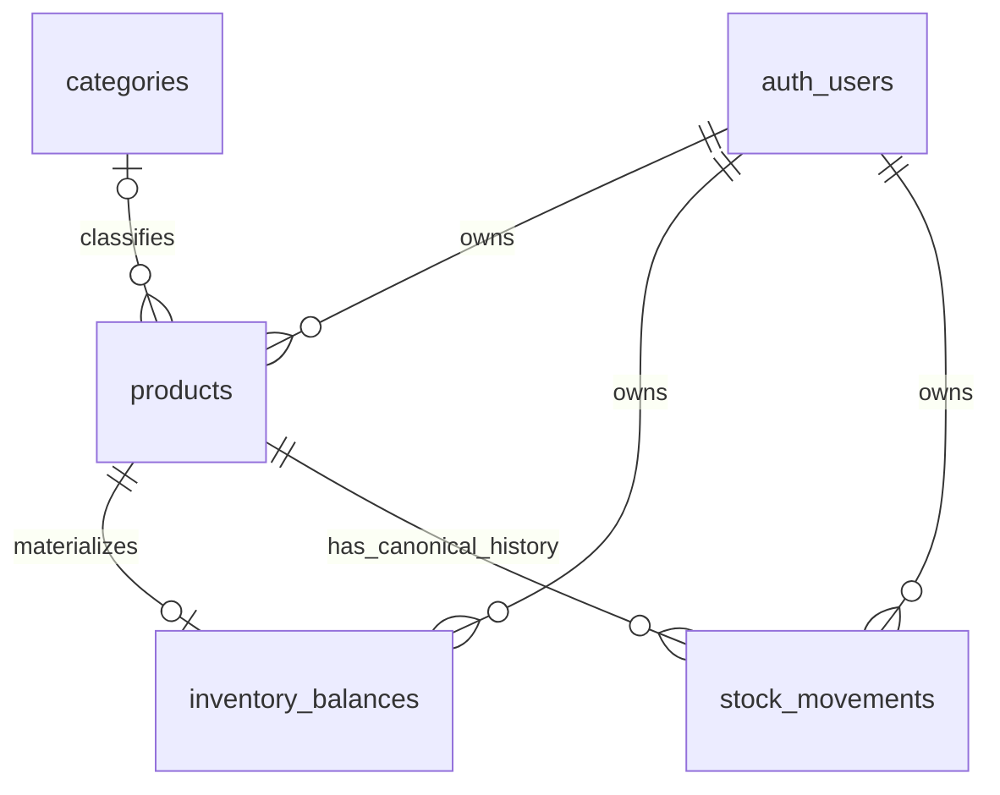
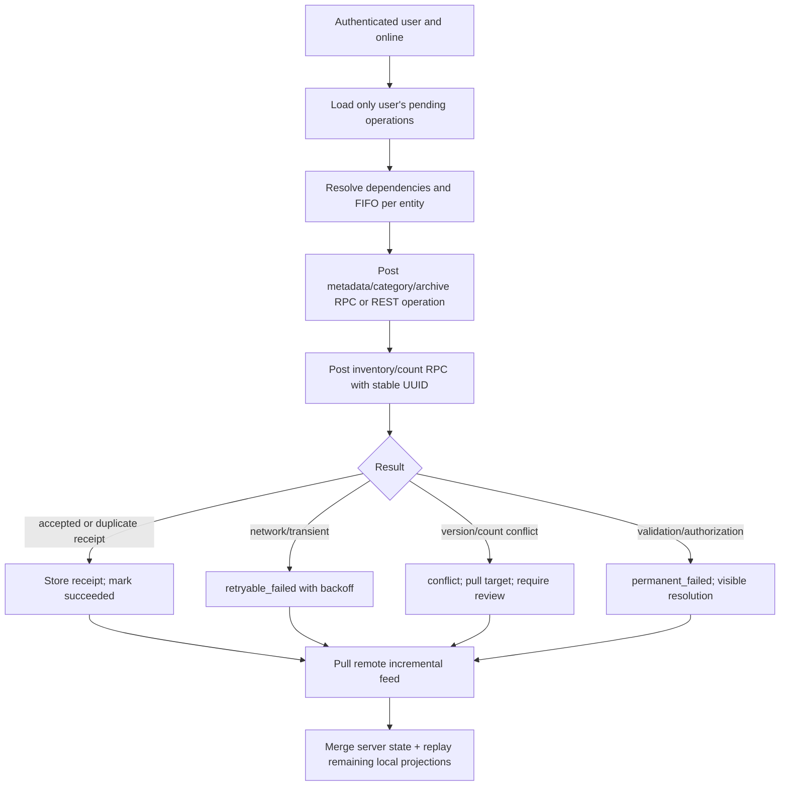

# DokkanX V2 — Data and Offline Foundation

**Status:** Step 3A technical design for review.  
**Scope:** Implementation-ready proposal only. No migration, schema, Dexie, code, RLS, environment, production-data, or production-command change is authorized by this document.

This design implements the approved V2 product rules in [02 Product and Inventory](02-PRODUCT-AND-INVENTORY.md) while preserving the V1 local-first model documented in the project-discovery set.

## 1. Current-state technical baseline

### Active client behavior

- `src/lib/db.js` defines `DokkanexDB` Dexie version 2 with `products`, `categories`, a non-user-scoped `sync_queue`, and `app_meta`.
- `offlineOps.js` writes product/category changes locally first, creates client UUIDs for records, and appends generic `INSERT`/`UPDATE`/`DELETE` queue items.
- `syncManager.js` pushes queue rows one-by-one, then pulls all remote categories and products for the active user. It has no idempotency keys for updates/deletes, conflict policy, failed-operation state, or per-account isolation.
- Product images are base64 locally until sync; the current implementation can delete an old Storage object before the replacement product update has safely completed.
- The browser has a normal anon/authenticated Supabase client **and an unacceptable service-role client** in `src/lib/adminSupabase.js` used by admin code.

### Pulled production baseline: confirmed findings

`supabase/migrations/20260913182956_remote_schema.sql` is now the schema source of truth. It contains more historical ERP-era schema than the current UI uses:

| Existing object | Confirmed state | V2 implication |
|---|---|---|
| `products` | V1 columns plus unused `sku`, `cost_price numeric(12,2) NOT NULL default 0`, `quantity numeric(12,2) NOT NULL default 0`, `min_quantity numeric(12,2) NOT NULL default 0`, `unit text NOT NULL default 'piece'`, `is_active`, `deleted_at` | Do not treat `quantity=0`, `min_quantity=0`, `cost_price=0`, or `unit='piece'` as confirmed user-entered V2 data. The active client ignores these columns. |
| `stock_movements` | Existing table: `id`, `user_id`, `product_id`, `qty_change`, `reason`, optional references/note, `created_at` | Reuse/evolve it rather than creating a competing movement-history table, after audit of current row count/meaning. |
| `customers`, `suppliers`, purchases/invoices/items/payments/ledger | Present, RLS enabled, not used by current `master` UI | Out of V2 Core; do not make V2 inventory depend on them. |
| `products` / `categories` RLS | Multiple overlapping permissive ownership policies (`auth.uid() = user_id`), including duplicate product policy sets | Effective ownership intent is sound, but policies should be consolidated carefully in a later audited migration. |
| `stock_movements` RLS/grants | RLS policies allow own-user CRUD, but `authenticated`/`anon` lack SELECT/INSERT/UPDATE/DELETE grants; only maintenance-style grants exist | Current browser cannot use the table normally despite policies. V2 must explicitly grant only the required read capability and use an authenticated RPC for posting. |
| Storage `product-images` | One `TO PUBLIC FOR ALL` policy checks only bucket id | Any client covered by that policy can act on any object in the bucket; current unprefixed filenames cannot safely be owner-scoped without a compatibility plan. |
| Product/category ownership | `user_id` is nullable in both table definitions; RLS prevents normal cross-user/null access | V2 writes must retain `user_id = auth.uid()` enforcement. |

The baseline contains an `update_updated_at` trigger on products but no revision/version column. `products.quantity` and the historical movement table do **not** establish that a product has V2 inventory initialized. V2 must not backfill from either one without a separately approved data audit.

## 2. Design goals and boundaries

1. Preserve all V1 accounts, products, categories, images, and both historic price columns untouched.
2. Represent stock as append-only, idempotent inventory activity plus an efficient derived balance.
3. Make a missing balance row the only authoritative representation of **Stock not set**; an existing balance row with `0` is an explicitly initialized zero.
4. Keep normal browser work on the anon/authenticated client; no service-role browser access.
5. Permit negative quantity after a deliberate V2 UI warning; never clamp it.
6. Support independent additive changes from offline devices without overwriting each other.
7. Use optimistic concurrency for mutable product metadata, but not an enterprise collaboration system.
8. Add only V2 Core concepts. Do not add organization, warehouse, branch, conversion, barcode, variant, supplier, or purchasing domain dependencies.

## 3. Proposed V2 remote data model

### Overview



`stock_movements` remains the canonical audit history. `inventory_balances` is a one-row-per-initialized-product materialization maintained only by transactional database functions. Its row existence, rather than any numeric default, distinguishes initialized from unset stock.

### 3.1 Products: additive V2 fields

Keep every existing column. Add only:

| Proposed field | Type / default | Purpose |
|---|---|---|
| `low_stock_threshold` | `numeric(20,6) NULL` | V2 threshold. NULL means not configured; do not use existing `min_quantity` as a source. |
| `metadata_version` | `bigint NOT NULL DEFAULT 0` | Server-managed optimistic-concurrency revision for V2 product metadata. |
| `archived_at` | `timestamptz NULL` | V2 archive marker. Existing `deleted_at` remains untouched until a deliberate compatibility mapping is approved. |

Use the existing `unit` field as the V2 stock-unit column **only after data audit**. It is already non-null/default `piece`; that default does not mean a legacy user selected it. V2 can display Piece for legacy products but must keep their inventory state unset. Add a non-destructive unit validation strategy: permit the approved V2 values (`piece`, `pack`, `box`, `meter`, `kilogram`, `gram`, `liter`) for new/changed V2 values; do not add a validating check that could reject unknown legacy values before audit. A later validated constraint follows cleanup, not the foundation migration.

`metadata_version` has exactly one increment mechanism: the product update trigger increments it once on every accepted product update, including a V1 client write. `update_product_metadata(...)` requires `expected_metadata_version` and performs one atomic conditional update (`WHERE id = … AND user_id = auth.uid() AND metadata_version = expected_metadata_version`); it **does not** increment the version itself. The trigger supplies the single increment, and the RPC returns the resulting canonical row/version. This lets V2 notice V1/other-device changes instead of overwriting them blindly.

### 3.2 `inventory_balances`: new derived materialization

Create one balance row only after stock initialization/activity:

| Field | Type / constraint | Notes |
|---|---|---|
| `product_id` | `uuid PRIMARY KEY REFERENCES products(id) ON DELETE RESTRICT` | One balance per product; preserves history by blocking hard delete. |
| `user_id` | `uuid NOT NULL REFERENCES auth.users(id) ON DELETE CASCADE` | Must equal the product owner; function enforces it. |
| `current_quantity` | `numeric(20,6) NOT NULL` | Signed; permits zero and negative. Never NULL for a balance row. |
| `initialized_at` | `timestamptz NOT NULL` | Establishes that an explicit stock state exists, including zero. |
| `last_movement_id` | `uuid NULL REFERENCES stock_movements(id)` | Informational pointer; nullable to avoid migration-order/circular-insert issues. |
| `revision` | `bigint NOT NULL DEFAULT 0` | Increments for every accepted movement. Used for local reconciliation and stock-count bases. |
| `updated_at` | `timestamptz NOT NULL DEFAULT now()` | Server-owned materialization timestamp. |

Indexes: primary key (`product_id`), `inventory_balances(user_id, current_quantity)`, and `inventory_balances(user_id, updated_at, product_id)`. The first supports per-user attention/filter queries; the second supports deterministic incremental pulls. The application computes status from `current_quantity`, `low_stock_threshold`, and balance-row existence; status is not stored.

### 3.3 Evolve `stock_movements`: canonical history

Do not replace the current table. Preserve all existing fields/rows, and add these V2 fields:

| Field | Type / constraint | Purpose |
|---|---|---|
| `movement_type` | `text NOT NULL DEFAULT 'legacy'` | V2 values: `opening`, `manual_add`, `manual_remove`, `stock_count`, `damage_loss`; future: `purchase`, `sale`, `sale_return`, `purchase_return`; preserves unknown historic rows as `legacy`. |
| `client_created_at` | `timestamptz NULL` | Device-recorded time for display/diagnosis; never used for canonical ordering. |
| `posted_at` | `timestamptz NOT NULL DEFAULT now()` | Server acceptance time. |
| `server_sequence` | `bigint NULL`, generated/assigned for new V2 inserts, unique when non-null | Monotonic V2 pull cursor; historic rows remain safely null/uninterpreted. |
| `base_balance` | `numeric(20,6) NULL` | Required for `stock_count`; known local balance at count time. |
| `counted_quantity` | `numeric(20,6) NULL` | Required for `stock_count`; physical count target. |
| `payload_hash` | `text NULL` for historic rows; conditionally required for V2 rows | Server-computed canonical request fingerprint for idempotency validation. |
| `reverses_movement_id` | `uuid NULL REFERENCES stock_movements(id)` | Optional explicit correction link. |

Existing `id` becomes the V2 stable **client-generated operation/movement UUID**. V2 always supplies it; do not rely on its existing database default for client-originated V2 activity. Existing `qty_change` is retained as signed `numeric`; V2 normalizes it to `numeric(20,6)`. Retain historical `reason`, `ref_type`, `ref_id`, and `note`; `reason` may contain user-provided context but is not the V2 type discriminator.

Constraints to add after legacy-row audit, without requiring existing rows to acquire V2-only values:

- `movement_type` defaults to `legacy`, so existing rows remain valid; an allow-list permits `legacy` plus V2/future approved types.
- `stock_count` requires non-null `base_balance` and `counted_quantity`; other V2 types leave those fields null.
- Non-opening V2 changes must be nonzero. `opening` explicitly permits `qty_change = 0`, which is the valid initialized-zero case.
- `payload_hash` is required only where `movement_type <> 'legacy'`; legacy rows may remain null.
- `server_sequence` is unique only where non-null. New V2 writes receive it server-side; historic rows do not need a fabricated sequence or reordered interpretation.
- `user_id`, product ownership, and correction ownership are enforced in the posting function, not trusted from client input.
- `id` remains the primary-key idempotency constraint. No separate operation table is needed for movement posting.

Indexes: `(user_id, server_sequence)`, `(product_id, server_sequence)`, `(user_id, product_id, posted_at DESC)`, and `reverses_movement_id` where non-null. Do not index every text reason or attempt to use a global time sort as a cursor.

### 3.4 Posting functions, not direct DML

Introduce database RPC functions in Step 3B, invoked by an authenticated browser client:

- `post_inventory_movement(...)`: opening/manual add/manual remove/damage/correction.
- `post_stock_count(...)`: count-specific compare-and-post behavior.
- `update_product_metadata(...)`: optimistic product metadata update, including unit safeguard.
- `archive_product(...)`: V2 archive action.

They may be `SECURITY DEFINER` only with a fixed `search_path`, revoked public execute, explicit `auth.uid()` ownership checks, narrowly granted `EXECUTE TO authenticated`, and no dynamic SQL from client values. They are not Edge Functions and require no browser secret. Direct client DML against `inventory_balances` and V2 movement posting is disallowed.

#### Inventory RPC idempotency order

The browser submits only a stable client-generated movement/operation UUID and request fields. It does **not** provide an authoritative payload hash. For both movement RPCs—and especially `post_stock_count`—the database uses this exact order:

1. Look up the movement UUID first.
2. If it exists, normalize the retry request server-side and compute its canonical payload hash; if it matches the stored **server-computed** hash, return the original accepted receipt/movement/balance immediately, even if the current balance has changed since the first acceptance.
3. If the UUID exists but the canonical payload differs, reject invalid UUID reuse.
4. Only when the UUID is new, normalize the request server-side, compute/store the canonical payload hash, then perform ownership, type/precision/unit validation, initialization checks, and—where applicable—stock-count base/balance checks before inserting.

The canonical hash is over the normalized allowed fields (including operation UUID, user/product identity, movement type, fixed-scale decimal strings, count base/target where relevant, correction reference, and permitted note/reason), not arbitrary client JSON key order or presentation formatting. The posting transaction stores this server-computed hash with the new row.

### Step 3B-B.1 concurrency and no-change clarification

Inventory RPCs acquire transaction advisory locks in one order: first a lock derived from the operation UUID, then a lock derived from the authenticated user ID, then perform UUID lookup and state validation. The first lock makes same-UUID retries/collisions serializable without exposing another user’s receipt. The second lock serializes each user’s V2 inventory transactions through sequence allocation and commit; `server_sequence` is therefore a safe **per-user** pull cursor, not a globally commit-ordered cursor.

**Permanent server-sequence invariant:** every future server path that creates a non-legacy `stock_movements` row—including sale, purchase, sale return, and purchase return—must acquire this same authenticated-user advisory transaction lock before allocating `server_sequence`. Without that lock, the per-user sequence cannot be treated as a safe incremental sync cursor. Sales and Purchases are not implemented by this foundation.

A stock count whose target equals the locked current balance returns typed `no_change`, writes no movement, and does not increment the balance revision. No durable operation receipt is created for that no-op. Step 3C must mark a received `no_change` response succeeded. If its response is lost, a retry can safely return `no_change` again while the state is unchanged, or a typed conflict after later activity; it must never create an artificial zero movement.

## 4. Inventory initialization and balance strategy

### Initialization truth table

| Balance row | Opening movement | Current quantity | User state |
|---|---|---|---|
| Absent | None | Unknown | Stock not set |
| Present | `opening`, delta `0` | `0` | Explicitly initialized; Out of stock |
| Present | `opening`, delta `> 0` | Positive | In stock/Low stock depending on threshold |
| Present | Any accepted movement | Negative allowed | Out of stock, negative attention |

The foundation migration creates **no** `inventory_balances` rows for existing products. It also does not derive or copy from `products.quantity`, `min_quantity`, `cost_price`, `unit`, or existing `stock_movements`. This prevents an old schema default from being recast as a user-entered stock balance.

### Stock-not-set manual-action rule

While a product has no balance row, normal **Add quantity**, **Remove quantity**, **Stock count**, and **Damaged/lost stock** actions are not presented as ordinary actions. The single primary action is **Initialize stock**. The user enters the actual currently known quantity, including an explicit zero where appropriate; this posts the opening movement and creates the balance row. Only after that accepted/local-pending initialization do normal adjustment actions become available. Sales behavior for Stock-not-set products is deliberately not decided here and belongs to the future Sales specification.

### Canonical vs derived records

| Record | Role | Write rule |
|---|---|---|
| `stock_movements` | Canonical auditable history | Append only through posting RPC; correction is a new movement. |
| `inventory_balances` | Derived current balance/read model | Updated in the same database transaction as its movement; never directly edited by browser UI. |
| Local `inventory_movements` / `inventory_balances` | Offline mirror plus optimistic projection | Reconciled to accepted server records; local pending activity overlays pulled remote balance. |

The RPC takes a row lock on the product’s balance (`SELECT … FOR UPDATE`), checks idempotency, inserts the movement, applies its exact decimal change, increments balance `revision`, and returns the accepted movement plus materialized balance in one transaction. A remote UI therefore reads a single balance row, not an unbounded sum of history.

### Balance integrity and rebuild design

Every accepted V2 movement and its balance update occur in the same transaction. Automated integration tests must prove, per initialized product, that the sum of canonical accepted V2 movement deltas equals `inventory_balances.current_quantity`; products with no accepted V2 initialization/activity must have no balance row.

Provide a server-side diagnostic/maintenance path that is unavailable to ordinary browser users: it reports products where recomputed canonical totals differ from materialized balances, and can rebuild a selected user/product scope from accepted V2 movements under an authorized maintenance role or documented, reviewed SQL procedure. It must acquire appropriate locks, reconstruct in deterministic `server_sequence` order, set revision/last-movement data consistently, and delete/no-op no balance only where there are no accepted V2 movements. It must never manufacture balance rows for legacy-only products. This is an operational repair path, not an app feature, RPC granted to users, or regular synchronization action.

## 5. Decimal and precision policy

| Layer | Representation | Rule |
|---|---|---|
| PostgreSQL | `numeric(20,6)` for quantities, thresholds, deltas, bases, and counts | Six fractional places supports V2 units while avoiding binary float errors. All stock arithmetic occurs in PostgreSQL numeric inside the posting transaction. |
| IndexedDB | Canonical decimal **strings** (for example, `"2.500000"`, `"-0.125000"`) | Do not persist calculated JavaScript `Number` values as authoritative stock. |
| JavaScript | Decimal library, recommended `decimal.js-light`, configured to scale 6/explicit rounding | Use only for local preview/projection. Convert request payloads from normalized strings; never use IEEE-754 arithmetic for stock decisions. |
| Display | Locale-formatted decimal from the normalized string, trim insignificant trailing zeroes | Preserve enough precision to represent stored values; never round a value before posting. |

Step 3B should add the decimal dependency and one shared `quantity` utility that parses, validates finite values, normalizes to six places, compares, adds/subtracts, and formats. Product prices require a separate, explicit policy; do not silently change existing unbounded `wholesale_price`/`selling_price` precision in this foundation.

## 6. Unit and threshold policy

- The existing `products.unit` is the single V2 stock unit. Default/display fallback is Piece.
- Unit can change while no `inventory_balances` row exists (Stock not set).
- Once a balance/history exists, an **actual change** to `unit` must be rejected by the metadata RPC and a database trigger for direct updates. The safeguard compares old and new values (`IS DISTINCT FROM`); unchanged legacy/V1 writes that include the same unit remain valid. User guidance for an actual change: create a replacement product in the desired unit and initialize it; unit conversion is deferred.
- `low_stock_threshold` is nullable. Known positive stock with NULL threshold is In stock. Low stock means `current_quantity > 0 AND current_quantity <= threshold`. Zero/negative is Out of stock regardless of threshold.
- Existing `min_quantity` remains historical/uninterpreted. No backfill from it.

## 7. Metadata conflict policy

Mutable metadata (name, category, image reference, selling price, threshold, and unit before initialization) has a different conflict model from additive inventory movement.

### Policy

1. Pull remote product records with `metadata_version`.
2. Local metadata edit stores its `base_metadata_version` in a metadata outbox operation.
3. `update_product_metadata` updates only if the expected version matches the current remote version. It does not increment the revision; the one product update trigger increments it exactly once and the RPC returns that canonical resulting version.
4. On match, accept, return the canonical product, and replace the local projection.
5. On mismatch, do **not** last-write-wins silently. Mark the operation `conflict`, pull the remote product, retain the local draft/payload, and show a concise review action.
6. The V2 Core resolution is manual: user reviews current values and resubmits intentionally against the new version. Per-field merge is not required initially.

This is deliberately stricter than the V1 generic queue because names/prices/categories/image references can otherwise predictably lose another device’s change. Inventory movements remain additive and do not use this metadata-version conflict path.

**Step 3C retry note:** a metadata update can commit remotely while the client loses its response. If retry receives a stale-version conflict, Step 3C must pull the canonical product. It may resolve the operation as succeeded only when the intended whitelisted fields are already represented by that canonical product in a safely recognizable way; otherwise it preserves the local payload as a reviewable conflict and never silently overwrites.

## 8. Stock-count offline conflict policy

A count is an assertion of an actual balance, not merely a signed `-2` event. It needs a compare-and-post rule.

```mermaid
sequenceDiagram
  participant D as Offline device
  participant R as Remote balance
  D->>D: Base 20; physical count 18; local projected 18
  Note over R: Another device posts +5; remote becomes 25
  D->>R: post_stock_count(base=20, counted=18, operation id)
  R-->>D: conflict: current is 25, revision changed
  D->>R: Pull current balance/history
  D-->>D: Mark count Needs review; do not silently post -2
```

`post_stock_count` first applies the UUID-first idempotency order in section 3.4. For a previously accepted matching UUID, it returns the original receipt even if the balance has changed. Only a new UUID locks the current balance and accepts when `(current_quantity, revision)` equals the count’s recorded base. It then calculates `counted_quantity - current_quantity` server-side, writes one `stock_count` movement, and updates the materialization.

On mismatch, it writes no movement and returns a typed conflict with the current balance/revision. The local outbox becomes `conflict`; the optimistic local projection must be reconciled to the pulled remote balance and clearly marked for review. The user can either discard the count or choose **Use counted quantity 18**, which creates a *new* count operation with the latest base and target. This may create `-7` from current 25, because that is the intentional physical-count correction.

This avoids silently applying an old `-2` to a remote `25` and avoids hiding the multi-device edge case. It is a V2 Core limitation that such a count requires user review after concurrent remote stock activity.

## 9. V2 local outbox and sync design

### 9.1 Replace gradually, not abruptly

The current `sync_queue` cannot safely carry V2 inventory operations: it lacks user ownership, stable operation identity, errors, status, and conflict state. Introduce a new user-scoped `outbox_operations` store in Dexie version 3; leave the old queue readable during a compatibility migration.

During Step 3B, migrate V1 pending queue rows into V2 outbox records where possible, preserving FIFO creation order. Do not delete old queue rows until their equivalent V2 operation is durably created in the same Dexie transaction. New V2 product/category writes use the new outbox. Inventory posts use event-specific operations from the first release. The old generic queue is removed only in a later cleanup release after telemetry/backup confirmation.

### 9.1a Category conflict and deletion policy

Categories are a low-risk metadata domain, so V2 Core intentionally uses simple ownership-protected last-write-wins for category create/rename. A category outbox update carries the complete intended name and, after a successful remote write, the canonical remote row is pulled back; concurrent renames may overwrite one another, and no conflict UI/version column is added in V2 Core. This limitation is acceptable because categories are optional labels, unlike product prices/images or inventory.

Category deletion is different: it must not silently orphan product references. The actual baseline foreign key is `products.category_id REFERENCES categories(id) ON DELETE SET NULL`. Therefore the V2 delete operation may proceed only through an ownership-protected server path that makes the outcome explicit: affected products become uncategorized (`category_id = NULL`) remotely and locally after pull. The V2 UI must warn when the category is in use and never leave a stale local reference. A direct old-client category deletion uses the same database FK behavior, so local sync must refresh affected products after success.

### 9.2 `outbox_operations` local store

| Field | Purpose |
|---|---|
| `operation_id` (UUID primary key) | Stable idempotency key; inventory movement id equals this value. |
| `user_id` | Mandatory active-account ownership; no cross-account processing. |
| `entity_type` | `product_metadata`, `category`, `inventory_movement`, `stock_count`, `image_upload`, `image_delete`, `product_archive`. |
| `action` | e.g. `create`, `update`, `archive`, `post`; not generic raw SQL semantics. |
| `entity_id` | Product/category/movement target UUID. |
| `payload` | Canonical serializable payload, including expected revision/base count where needed. |
| `depends_on` | Optional operation IDs; image metadata update depends on uploaded object URL. |
| `created_at`, `updated_at` | Client timestamps for order/diagnosis. |
| `sequence` | Per-device monotonic local sequence for deterministic FIFO within a dependency chain. |
| `status` | `pending`, `syncing`, `succeeded`, `retryable_failed`, `conflict`, `blocked`, `permanent_failed`. |
| `attempt_count`, `last_attempt_at`, `last_error_code`, `last_error_message` | Retry/UI diagnostics; never expose raw sensitive server details. |
| `server_receipt` | Accepted revision/movement/balance data for reconciliation/debugging. |

Indexes: `[user_id+status+sequence]`, `[user_id+entity_type+entity_id]`, `[user_id+created_at]`, and `depends_on`. Dexie composite index syntax/upgrade mechanics are Step 3B implementation details.

### 9.2a Outbox retention

The outbox is transport state, not audit history. Retain a `succeeded` operation only until both (a) it has a durable server receipt and (b) the corresponding canonical remote entity/movement/balance has been pulled and reconciled into local stores. Then delete it in a bounded cleanup pass, for example on successful sync when it is at least seven days old, keeping a capped recent diagnostic window (such as the latest 100 succeeded operations per user) if that does not delay cleanup indefinitely. Never delete pending, retryable-failed, conflict, blocked, or permanent-failed operations automatically. Canonical history remains in local/remote inventory movements and remote `stock_movements`, not in retained outbox rows.

### 9.3 Local data stores and cursor

Dexie version 3 adds or updates:

| Store | Purpose / indexes |
|---|---|
| `products` (existing) | Preserve every V1 row; add V2 projection fields such as `metadata_version`, `low_stock_threshold`, `archived_at` as remote data arrives. Index `[user_id+updated_at]`, `[user_id+metadata_version]` if useful. |
| `categories` (existing) | Preserve rows; scope all clear/pull operations to `user_id` rather than global clear. |
| `inventory_balances` (new) | Key `product_id`; indexes `user_id`, `[user_id+current_quantity]`, `[user_id+updated_at]`; contains local remote base plus pending projection metadata. No row = unset. |
| `inventory_movements` (new) | Key `id`; indexes `user_id`, `product_id`, `[user_id+product_id+server_sequence]`, `[user_id+server_sequence]`, `status`; holds accepted and local-pending activity. |
| `outbox_operations` (new) | As specified above. |
| `sync_state` (new) | Per-user/entity cursor, last successful pull, and schema migration marker. Replace global `app_meta.last_sync` for V2. |
| `image_blobs` (new or product-local field retained temporarily) | Locally staged image blob/base64 keyed by operation ID; avoids embedding large durable image payloads in arbitrary metadata operations. |

Do not clear all categories/products/balances on account switching. Every read, pull, local projection, and outbox query filters `user_id`. On login, select only that account’s browser-local, user-scoped partition. On logout, stop sync and retain that browser-local data for later session restoration; do not process or display another account’s pending operations. DokkanX currently provides no application-level encryption of IndexedDB. A future explicit “remove offline data for this account” control may purge only that account after confirmation.

### C1 legacy queue bridge refinement

Dexie V3 retains every V1 `sync_queue` row unchanged. The schema upgrade does not assign it to whichever account happens to be logged in, because upgrade can occur before reliable Auth context exists. C2 bridges only proven category CRUD; unsupported product mutations and ambiguous/unowned rows receive a local `blocked` marker and remain unsubmitted. C2 is a separate data-layer runner; the existing V1 runtime remains active until C3 explicitly wires the replacement lifecycle, preventing two engines from processing the same bridged operation.

### 9.4 Sync algorithm



Detailed sequence:

1. Lock a single sync runner per browser/account; never process operations for a stale AuthContext user.
2. Recover abandoned `syncing` records to `pending` on app start if no receipt is present.
3. Push ready operations in deterministic local sequence, respecting dependencies. C2 does not coalesce business operations; image staging/dependency sequencing is C3 work. Never coalesce inventory movement/count operations.
4. For movement/count RPC calls, preserve the same `operation_id` across every retry. Treat a primary-key duplicate with matching `payload_hash` as success and fetch/return the stored receipt/balance.
5. After a bounded batch, pull remote products, categories, balances, and movements using per-user `server_sequence`/updated cursor. Pull accepted movement history before calculating projections.
6. Within one Dexie transaction, merge remote accepted records and then replay still-pending local inventory operations in sequence to create the local projected balance. Keep conflicts visibly distinct from accepted/pending state.
7. Update sync state and user-facing pending/failed counts. Do not claim complete sync while conflict/permanent-failure operations remain unresolved.

### 9.5 Retry and idempotency

| Outcome | Local behavior | Server behavior |
|---|---|---|
| Timeout/offline/5xx | Keep UUID and payload; exponential backoff with jitter; retry on online/manual sync | No assumption whether operation committed; idempotency lookup makes retry safe. |
| First accepted post | Store server receipt and balance; mark succeeded | Insert one movement, mutate one balance in one transaction. |
| Repeated same UUID/same hash | Mark succeeded using receipt | Return existing movement/balance; never add quantity again. |
| Same UUID/different hash | Mark permanent failure/security diagnostic | Reject; UUID reuse is invalid. |
| Metadata version mismatch | Mark conflict; preserve draft | Reject without write; return current revision. |
| Stock-count base mismatch | Mark conflict; pull/review | Reject without movement. |
| Validation/RLS denial | Permanent failed; user can correct/discard | No write. |

Retry schedule: immediate attempt on explicit sync/online event; thereafter bounded exponential delay (for example 5 s, 30 s, 2 min, 10 min, maximum 30 min) with jitter. Attempts do not mutate payload or operation UUID. Failed operations must be visible through a small sync-detail surface, not only a numeric pending badge.

## 10. Multi-device behavior

V2 Core does not promise live collaborative editing. It does make independent additive inventory activity safe: a device posts `+5` and another posts `-3`; both append and the locked remote materialization becomes the sum regardless of arrival order. The device later pulls the accepted order and reconciles its projection.

Known behavior:

- Product metadata uses explicit optimistic conflict rather than silent loss.
- Stock counts are conditional and require review when a remote change intervened.
- Negative balance is permitted after UI warning; delayed/offline activity may create it legitimately.
- No reservation, allocation, guaranteed “available at checkout,” real-time subscription, or cross-device locking is provided in V2 Core.

## 11. RLS and security design

### New table policies

| Object | Authenticated browser capability | Policy/design |
|---|---|---|
| `inventory_balances` | `SELECT` own rows only | RLS `auth.uid() = user_id`; grant SELECT only. No direct browser insert/update/delete. |
| `stock_movements` | `SELECT` own rows only | RLS ownership select; grant SELECT only. Remove/revoke public direct UPDATE/DELETE; direct INSERT is not used for V2 posts. |
| Posting RPCs | `EXECUTE` only for authenticated | Function validates `auth.uid()`, product owner, allowed type/payload, and uses transactional writes. Revoke `PUBLIC` execute. |
| Product metadata RPC | `EXECUTE` only for authenticated | Ownership + expected version; restrict mutable field list and enforce unit rule. |
| Archive RPC | `EXECUTE` only for authenticated | Owner only; archive rather than hard delete. |

All new tables have RLS enabled and explicit grants. No policy uses a user-supplied `user_id` without comparing it to `auth.uid()`. The balance/posting functions must verify that `stock_movements.user_id`, `inventory_balances.user_id`, and `products.user_id` agree.

### Baseline remediation to plan, not execute in Step 3A

- Consolidate duplicate `products` and `categories` ownership policies only after local RLS regression tests prove equivalent access.
- Correct `stock_movements` grants/policies to append-only V2 rules. Any historical app needing direct writes must be identified first; current `master` does not.
- Audit and replace the broad `storage.objects` “Public Access” policy with least-privilege policy compatible with existing unprefixed objects and future user/product-prefixed keys. Do not remove it until old image reads and V1 upload/delete compatibility are tested.
- Ensure new schema functions have safe ownership/search path and only necessary grants.

## 12. Admin removal plan

Step 3B removes admin capability from the Store application; it does not build its replacement.

| File/area | Required change in Step 3B |
|---|---|
| `src/lib/adminSupabase.js` | Delete browser service-role client. |
| `src/lib/adminOps.js` | Delete Store admin operations. |
| `src/components/AdminRoute.jsx` | Delete. |
| `src/components/AdminLayout.jsx`, `AdminNavbar.jsx` | Delete. |
| `src/pages/admin/AdminOverviewPage.jsx`, `AdminUsersPage.jsx`, `AdminProductsPage.jsx` | Delete. |
| `src/App.jsx` | Remove admin imports, `AdminRoute`/`AdminLayout`, and `/admin`, `/admin/users`, `/admin/products` routes. |
| `.env` / deployment secret configuration | Remove `VITE_SUPABASE_SERVICE_ROLE_KEY` requirement/value from Store environments after code release; rotate the exposed service key through authorized production procedure. |
| `package`/docs | Remove admin claims and update Store configuration/docs. |

Deployment safety: the Store build must be scanned to confirm no service-role literal/env reference remains before release. Normal catalog users use only `src/lib/supabase.js`; test login, product/category CRUD, image upload, sync, and offline recovery with no service-role environment variable. Existing superadmin accounts continue to authenticate as ordinary Store users; their cross-user administration is intentionally unavailable until the separate admin application exists.

## 13. Image consistency design

Use immutable, operation-specific object names, preferably `${userId}/${productId}/${operationId}.jpg`, for every new image upload. This keeps a retry tied to one operation and prevents an overwrite from destroying another image.

### Replace image safely

1. Keep the old product image reference unchanged locally/remotely while preparing the new staged image.
2. Upload the new object. Retry the same object path/idempotent upload behavior as needed.
3. Post the product metadata update with optimistic version and new URL/path.
4. Only after that update is accepted, enqueue an `image_delete` operation for the prior object.
5. Before deletion, verify the current remote product no longer references that prior path. If deletion fails, retain an orphan candidate for later cleanup; never roll back the accepted product pointer or delete the active object.

### Remove image safely

1. Post metadata update that clears the reference.
2. After accepted receipt, enqueue best-effort old-object deletion with the same current-reference verification.

This intentionally prefers a recoverable orphan over a broken product image. The existing `deleteImage()`-before-update behavior must not remain in V2 image flow.

## 14. Product deletion/archive strategy

Once stock history exists, a product must not be hard-deleted by normal V2 UI. The V2 user action is **Archive product**:

- Set `archived_at`; retain product, balance, image reference, and history.
- Exclude archived products from ordinary Products/Inventory lists by default, with a future simple “Archived” filter/settings path.
- Keep the product available in historical activity/returns later; do not orphan movements.
- Do not automatically delete its image on archive. Cleanup requires a separately safe retention policy.

Products without V2 history can use archive as well for consistent user understanding. Existing `deleted_at` is not repurposed in Step 3B without audit; use the new `archived_at` field to avoid silently changing prior ERP semantics.

Compatibility limitation: an old cached V1 client still performs hard delete. The existing foreign key already prevents deletion when `stock_movements` reference a product, which is safer than orphaning history but may surface a sync failure in that old client. Step 3B must replace the V2 UI action first, preserve V1 writes during the initial foundation migration, and document this protected failure mode. Do not weaken the history foreign key to make legacy hard delete succeed.

## 15. Dexie migration and legacy local-data plan

### Upgrade sequence

1. Add `db.version(3)`; never alter earlier version declarations.
2. Define new stores/indexes listed in section 9.3 and updated indexes for existing tables.
3. In the version-3 upgrade transaction, preserve all current product/category records exactly. Missing V2 fields stay absent/NULL locally; absence of a balance row means Stock not set.
4. Convert each legacy `sync_queue` row to one `outbox_operations` row with the known active user only when ownership can be determined from payload/entity. Preserve chronological order and mark ambiguous/unowned queue entries `blocked` rather than submitting under a later account.
5. Retain the old queue until all converted operations have a terminal receipt and a later cleanup migration is approved.
6. Create per-user `sync_state` cursors only after successful remote pull; do not use global `app_meta.last_sync` for V2 correctness.

### Recovery requirements

- Dexie upgrade must be atomic: if it throws, the prior database stays intact and application startup presents a recoverable “offline data upgrade needs retry” state rather than clearing storage.
- Handle `versionchange` by closing existing tabs as current code begins to do; prompt stale tabs to reload before retrying.
- Never instruct users to clear browser data as the normal fix. Provide diagnostic/export guidance only after an explicit failure path is designed.
- Account switching filters every store by `user_id`; product primary keys alone are not sufficient isolation because all accounts share one browser database. These are browser-local, user-scoped partitions only: DokkanX currently provides no application-level encryption of IndexedDB.

## 16. Legacy remote-data migration plan

The foundation migration is additive and does not touch current product/category records except adding nullable/defaulted columns and server-managed revision behavior.

1. Before writing migration SQL, run a **local copy** audit against the pulled baseline/data backup: counts of `products.quantity`, `min_quantity`, `cost_price`, `unit`, and `stock_movements`; distinct movement reasons; existing deleted/active fields; and unexpected unit values. No production query is part of Step 3A.
2. Add V2 product fields, evolve movement schema, add balance table/RPCs/RLS/grants, and add indexes in a locally reset database.
3. Do not create balances/opening movements for legacy products. Therefore all legacy products are Stock not set, including those whose historical `quantity` happens to equal zero.
4. V2 users initialize stock progressively. Explicit opening zero creates both a zero balance and opening movement.
5. Historic `stock_movements` rows remain preserved as `legacy` and are not incorporated into V2 balance unless a separately approved data-quality migration is later designed.

**Data-audit gate:** if production inspection proves that `products.quantity` and/or `stock_movements` contain trusted, user-visible stock history from a prior released product, stop before release and obtain a decision on whether to preserve it as V2 initialization/history. The active current client does not use it, so this design safely defaults to treating it as untrusted legacy data.

## 17. `wholesale_price` / cost compatibility recommendation

The safest foundation choice is **do not change price semantics in Step 3B**:

- Retain `products.wholesale_price` unchanged; it is currently required and actively read/written by V1 client code.
- Retain the existing `products.cost_price` unchanged; its baseline default `0` and absent V1 usage mean it cannot be assumed to be a meaningful cost.
- Do not add another cost column in the inventory foundation. A third price field would increase ambiguity and migration risk.
- V2 UI may temporarily display neutral compatibility wording only after product/product-design approval, but it must not write a different column or relabel old values as acquisition cost without semantic confirmation.

Before a later Purchase price/Cost implementation, audit data and obtain an explicit decision: (a) `wholesale_price` is confirmed cost and can be relabeled, (b) it is a selling price tier and a new nullable cost field is needed, or (c) a user-assisted mapping is required. This is a release gate for price-label change, not for the inventory foundation itself.

## 18. Testing foundation required before production migration

Add a minimal test stack in Step 3B before any production foundation migration:

| Layer/tool | Required coverage |
|---|---|
| Vitest + `fake-indexeddb` | Decimal utility; Dexie v2→v3 migration; per-user isolation; outbox states/order/retry; local projection; legacy Stock not set. |
| Vitest + `@testing-library/react` | Sync status/failed-operation states and key offline UX boundaries once V2 components exist. |
| Local Supabase CLI reset + SQL/RPC integration tests (psql or a Node test harness using authenticated test JWTs) | Fresh migration recreation; grants/RLS own-row isolation; no direct balance/movement mutation; opening zero vs absent balance; idempotent duplicate post; mismatched UUID/hash rejection; negative balance; count conflict; archive protection. |
| Playwright | Browser IndexedDB upgrade without clearing data, offline create/adjust/reconnect, two-user same-browser isolation, image replacement/removal sequence. |
| Storage integration test against local Supabase | New upload -> metadata acceptance -> old-object delete; failed metadata leaves old object/reference intact; cleanup never deletes current image. |

Minimum invariant fixtures include two users, one V1 legacy product with no balance, one explicit-zero product, a decimal-unit product, a negative-balance product, a pending retry operation, a metadata conflict, and a stock-count conflict.

The SQL/RPC suite must additionally prove the balance-integrity invariant after every accepted opening/add/remove/count/damage/correction: canonical accepted movement sum equals the materialized balance. It must test drift detection/rebuild on a controlled fixture and prove that rebuild does not create a balance for a legacy Stock-not-set product.

**Non-blocking pre-production hardening:** the server drift diagnostic must ultimately compare canonical movement/balance ownership against `products.user_id` as well as against each other. Current posting RPCs prevent normal creation of that corruption and rebuild fails safely, so this does not block C1/C2; it must be closed before production deployment.

CI should at least run unit tests, a local `supabase db reset` migration recreation, RLS/RPC integration suite, and production build. No cloud staging project is required for this gate.

## 19. Production rollout sequence

No production command is authorized in Step 3A. Step 3B release planning must use this sequence:

1. **Git checkpoint:** clean reviewed commit/tag before implementation; keep the pulled baseline migration immutable.
2. **Fresh recovery artifacts:** authorized fresh production database backup and `product-images` backup immediately before deployment; verify restorability, timestamp, and access.
3. **Local rehearsal:** reset local Supabase from baseline plus candidate additive migration; restore a sanitized/authorized representative backup if available; execute the full test matrix.
4. **Migration review:** inspect generated SQL for only intended additive columns/tables/functions/indexes/policies/grants; explicitly reject drops, renames, bulk quantity initialization, or price reinterpretation.
5. **Old-client compatibility rehearsal:** run a V1 build against local migrated schema for login, product/category create/edit, image upload, normal sync, and no-balance legacy products.
6. **V2 release candidate:** test Dexie v2 upgrade with real-shape local data; test offline actions, reconnect, duplicate retries, count conflict, and image safety.
7. **Deploy ordering:** deploy the additive remote migration first only after all tests pass; verify schema/RLS/RPC invariants; then deploy the Store V2 client with admin removal. Never deploy client behavior that needs a missing RPC/schema.
8. **Immediate verification:** test one normal user only with safe test records: legacy product remains Stock not set; explicit zero initialization; decimal add; warning/allowed negative; image replacement; offline reconnection; no service-role bundle reference.
9. **Monitor:** watch RPC/database errors, outbox permanent failures/conflicts, sync lag, RLS denials, Storage errors, and product/image integrity during a defined observation window.

Because no cloud staging exists, the local rehearsal must be treated as a release gate, not an informal smoke test.

## 20. Rollback and recovery strategy

### Before client deployment

If the candidate migration fails local/rehearsal tests, do not deploy it. Fix forward locally and repeat reset/tests.

### After additive schema migration but before/after V2 client release

- Prefer **application rollback** to the last V1 build when the schema additions are unused or backward-compatible; additive fields/tables do not require destructive rollback.
- Do not drop new tables/columns as an emergency response. They may contain accepted movement history.
- Disable/pause the V2 client delivery if a data-integrity defect is found; preserve failed/pending outbox data for diagnosis.
- If a faulty RPC/migration has written incorrect movements, use an approved corrective migration/append-only corrective movements or, only if necessary, restore from the verified backup under an explicit incident plan. Never “fix” by silently editing/deleting history.
- Restore Storage only when product reference and object backup are reconciled; avoid overwriting newly accepted objects blindly.

Recovery success criteria: V1 products/categories/images/accounts are accessible, no product is newly represented as zero solely from migration, accepted activity is explainable, and no client secret is reintroduced.

## 21. Known limitations intentionally accepted in V2 Core

- No unit conversion, variants, serial/batch/expiry, warehouses/branches, reservations, transfers, purchase orders, or advanced costing.
- No real-time collaborative locking; offline devices can require metadata/count conflict review.
- Stock count conflicts are manual review, not automatic merge.
- Negative stock remains possible by deliberate confirmation and may remain until corrected.
- Local browser data is not a multi-device backup; sync completion is required for remote durability.
- Image cleanup can leave safe orphan candidates after a failed delete; a later retention cleanup is separate work.
- Historic ERP-era quantity/cost/movement data remains untrusted/unmapped unless the data-audit gate proves otherwise.
- An old cached V1 client may experience protected hard-delete failure for a product with V2 history; this is preferable to orphaning audit history.

## 22. Exact Step 3B implementation plan

### A. Preparation and tests

1. Add Vitest, fake-indexeddb, Testing Library, Playwright, decimal library, and test scripts/configuration.
2. Create local Supabase/RPC/RLS test fixtures and run `supabase db reset` only against local development.
3. Establish failing tests for all section 18 invariants before writing foundation code.

### B. Database migration (new timestamped migration; never edit the pulled baseline)

1. Audit legacy data locally and record result.
2. Add product V2 fields and revision/update/unit-safeguard trigger behavior without backfill.
3. Create `inventory_balances`; evolve `stock_movements` additively; add indexes/constraints after legacy-safe defaults.
4. Create narrowly secured posting/metadata/archive RPCs.
5. Enable/review RLS, grants, policy consolidation, and append-only movement access; add local tests.
6. Do not change Storage policy until its compatibility tests and object-key transition plan are ready; image sequencing code can safely operate with current policy first.
7. Update the relevant `docs/project-discovery/` documents in the same Step 3B documentation commit. Clarify that earlier source-only discovery correctly described active application domains but could not verify remote schema; distinguish dormant remote ERP-era objects, active V2 schema, and active UI domains without rewriting historical Git claims.

### C. Offline/data layer

1. Upgrade `src/lib/db.js` to Dexie v3 with a non-destructive data migration and account-scoped stores.
2. Replace `src/lib/offlineOps.js` generic product/category operations with a V2 data layer that creates outbox operations and local projections; preserve a migration bridge for existing queue rows.
3. Replace/refactor `src/lib/syncManager.js` with user-scoped push/pull, dependency sequencing, receipts, typed failures, cursors, projection replay, and no global category clear.
4. Add shared decimal/unit/status helpers and image staging/cleanup sequencing; update `src/lib/supabase.js` image helpers accordingly.
5. Update `src/context/SyncContext.jsx` and `AuthContext.jsx` integration for account switch, operation states, logout-safe sync cancellation, and visible failed/conflict counts.

### D. Store admin removal

1. Delete `src/lib/adminSupabase.js`, `src/lib/adminOps.js`, `src/components/AdminRoute.jsx`, `src/components/AdminLayout.jsx`, `src/components/AdminNavbar.jsx`, and `src/pages/admin/`.
2. Update `src/App.jsx` to remove all admin imports/routes.
3. Remove the Store service-role environment requirement, rotate the exposed key through the approved production procedure, and prove the built bundle has no reference.

### E. Product/inventory UI and validation

1. Update `ProductForm`, product pages/cards, categories access, and create new Inventory/Product detail flows to use the approved V2 UX and new local data layer.
2. Implement offline flows, status messaging, initialization, manual adjustments, count conflict review, negative warning, archive, and image-safe replacement.
3. Run unit/integration/E2E/local reset/build validation, then follow the rollout sequence.

Expected files to change or be created in Step 3B:

- New `supabase/migrations/<timestamp>_v2_inventory_foundation.sql` and test SQL/scripts (not the pulled baseline).
- `src/lib/db.js`, `offlineOps.js`, `syncManager.js`, `supabase.js`, image/quantity helpers, and likely new inventory/outbox modules.
- `src/context/AuthContext.jsx`, `SyncContext.jsx`.
- `src/App.jsx`, product/category pages/components, new Inventory/Home/Sales/Purchases files as separately approved scope lands.
- Admin files listed in section 12 removed.
- `package.json`, lockfile, test/Playwright/Vitest configuration, CI workflow, translations, documentation, and environment templates/deployment configuration.

Step 3B must be split into reviewable commits: test foundation, additive schema/RLS/RPC, Dexie/outbox/sync, admin removal/security rotation plan, then V2 UI. Do not bundle an untested remote schema change with unrelated visual work.
